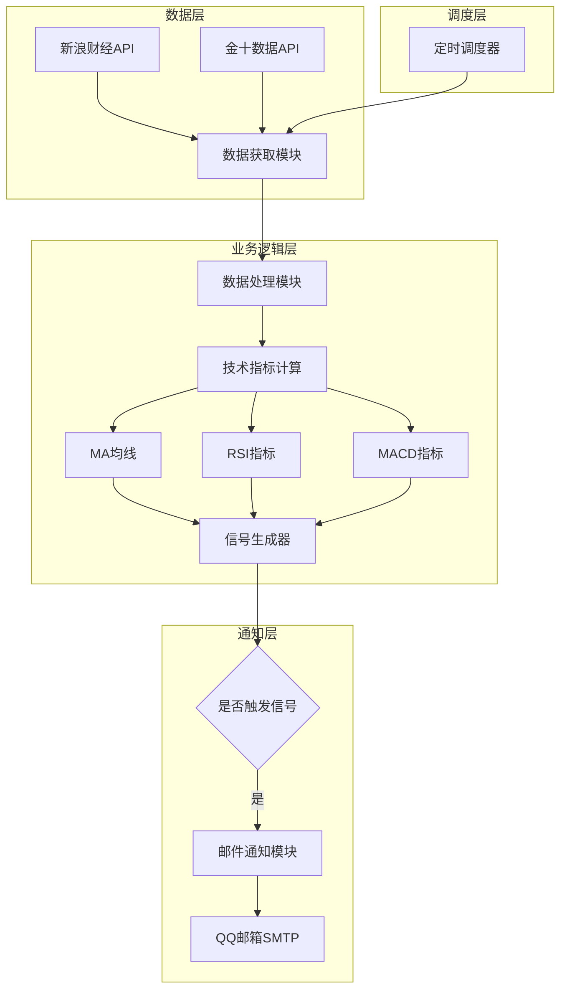
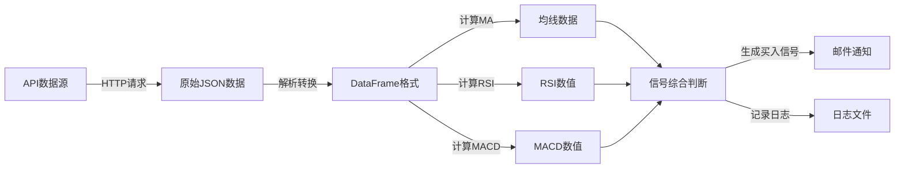

## 产品概述

黄金价格监控系统是一款自动化金融监控工具，每分钟实时获取黄金价格数据，通过技术指标分析生成买入信号，并在满足条件时通过QQ邮箱发送通知提醒用户。

## 核心功能

- **实时金价获取**: 每分钟从免费API（新浪财经/金十数据）获取最新黄金价格数据
- **技术指标分析**: 使用MA均线、RSI相对强弱指数、MACD指标组合进行多维度分析
- **智能买入信号**: 基于三种技术指标的综合判断，生成买入信号
- **邮件通知**: 当产生买入信号时，通过QQ邮箱SMTP服务发送通知邮件
- **运行日志**: 记录系统运行状态和信号生成历史

## 技术栈

- 编程语言: Python 3.9+
- 数据处理: pandas, numpy
- 技术指标计算: ta-lib 或 pandas-ta
- HTTP请求: requests
- 邮件发送: smtplib (Python标准库)
- 定时任务: schedule 或 APScheduler
- 配置管理: PyYAML

## 技术架构

### 系统架构

采用模块化分层架构，将数据获取、信号分析、通知服务分离，便于维护和扩展。



### 模块划分

| 模块名称 | 主要职责 | 关键技术 | 依赖模块 |
| --- | --- | --- | --- |
| data_fetcher | 从API获取黄金价格数据 | requests, json | 无 |
| signal_generator | 计算技术指标并生成信号 | pandas, numpy | data_fetcher |
| email_notifier | 发送邮件通知 | smtplib, email | signal_generator |
| scheduler | 定时任务调度 | schedule | 所有模块 |
| config | 配置管理 | PyYAML | 无 |


### 数据流



## 实现细节

### 核心目录结构

```
d:/project/golden/
├── src/
│   ├── __init__.py
│   ├── data_fetcher.py      # 数据获取模块
│   ├── signal_generator.py  # 信号生成模块
│   ├── email_notifier.py    # 邮件通知模块
│   └── scheduler.py         # 定时调度模块
├── config/
│   └── config.yaml          # 配置文件
├── logs/
│   └── .gitkeep             # 日志目录
├── tests/
│   ├── __init__.py
│   └── test_signal.py       # 单元测试
├── main.py                  # 程序入口
├── requirements.txt         # 依赖清单
└── README.md                # 项目说明
```

### 关键代码结构

**GoldPrice数据结构**: 定义黄金价格数据实体，包含时间戳、价格、涨跌幅等核心字段。

```python
from dataclasses import dataclass
from datetime import datetime

@dataclass
class GoldPrice:
    timestamp: datetime
    price: float
    change: float
    change_percent: float
```

**DataFetcher类**: 负责从新浪财经或金十数据API获取黄金价格，支持多数据源切换和异常处理。

```python
class DataFetcher:
    def __init__(self, api_source: str = "sina"):
        self.api_source = api_source
        
    def fetch_gold_price(self) -> GoldPrice:
        """获取当前黄金价格"""
        pass
    
    def fetch_history_data(self, days: int = 30) -> pd.DataFrame:
        """获取历史价格数据用于指标计算"""
        pass
```

**SignalGenerator类**: 实现MA、RSI、MACD三种技术指标的计算，并综合判断生成买入信号。

```python
class SignalGenerator:
    def __init__(self, config: dict):
        self.ma_period = config.get('ma_period', 20)
        self.rsi_period = config.get('rsi_period', 14)
        
    def calculate_ma(self, data: pd.DataFrame) -> pd.Series:
        """计算移动平均线"""
        pass
    
    def calculate_rsi(self, data: pd.DataFrame) -> float:
        """计算RSI相对强弱指数"""
        pass
    
    def calculate_macd(self, data: pd.DataFrame) -> tuple:
        """计算MACD指标"""
        pass
    
    def generate_signal(self, data: pd.DataFrame) -> dict:
        """综合三种指标生成买入信号"""
        pass
```

**EmailNotifier类**: 封装QQ邮箱SMTP发送功能，支持HTML格式邮件。

```python
class EmailNotifier:
    def __init__(self, smtp_config: dict):
        self.smtp_server = smtp_config['server']
        self.smtp_port = smtp_config['port']
        self.username = smtp_config['username']
        self.password = smtp_config['password']
        
    def send_signal_notification(self, signal: dict, recipients: list) -> bool:
        """发送买入信号通知邮件"""
        pass
```

### 技术实现方案

**1. 数据获取方案**

- 问题: 需要稳定获取黄金实时价格
- 方案: 优先使用新浪财经API，失败时切换金十数据备用
- 技术: requests库 + 重试机制 + 异常处理
- 步骤:

1. 构建API请求URL
2. 发送HTTP GET请求
3. 解析JSON响应
4. 转换为标准数据格式
5. 异常时切换备用数据源

**2. 技术指标计算方案**

- 问题: 需要计算MA、RSI、MACD三种指标
- 方案: 使用pandas进行数据处理，自实现指标算法
- 技术: pandas + numpy
- 步骤:

1. 获取最近30天历史数据
2. 计算20日移动平均线
3. 计算14日RSI值
4. 计算MACD(12,26,9)参数
5. 综合三指标判断买入时机

**3. 信号判断逻辑**

- MA买入条件: 价格上穿MA20均线
- RSI买入条件: RSI值低于30（超卖区域）
- MACD买入条件: DIF上穿DEA形成金叉
- 综合信号: 至少满足2个条件触发买入信号

### 集成要点

- 配置文件使用YAML格式，包含API密钥、邮箱配置、指标参数
- 日志使用Python logging模块，记录到logs目录
- QQ邮箱需要开启SMTP服务并获取授权码